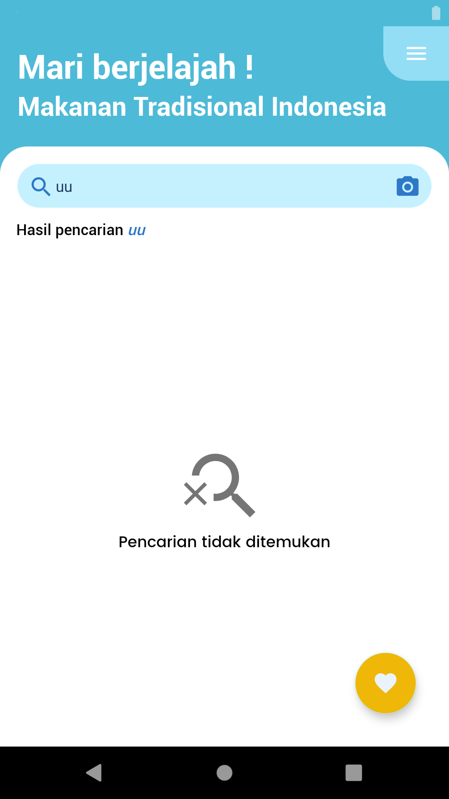

# The Food Explorer    
 [](http://developer.android.com/index.html) [](http://kotlinlang.org) [](https://developer.android.com/studio/releases/gradle-plugin)    
    
This repository is android implementation of Bangkit Academy Final Project (Kramcox Team).<br>
You can try the apps [here](https://drive.google.com/drive/folders/1Kz6W8kv0QnVNjXuK9yOC6QGkMmz9Xlgp?usp=sharing)
    
## Installation 
Clone this repository and import into Android Studio    
```
    https://github.com/SaveVic/the-food-explorer.git
```   

## Demo    
<h3 align="center"> Home Screen </h3>
<p align="center">

    
    
    
    
</p>

<h3 align="center"> Detail Screen </h3>
<p align="center">
    
    
    
</p>

## App Feature
- Search food by name or some keyword
- Search food by image
- Get food detail/description or trivia
- Get nearest store location (with google map) which sell the food

## Tech Feature :
- Using MVVM (Model-View-ViewModel) Architecture
- Using ViewBinding
- Using Retrofit to request api network
- Using Glide for load and caching image from url
- Using Image Picker for capture image from camera
- Using Shimmer animation for waiting indicator

## Dependencies :
- [Lifecycle & Livedata](https://developer.android.com/jetpack/androidx/releases/lifecycle)
- [Retrofit 2](https://square.github.io/retrofit/)
- [OkHttp 3](https://square.github.io/okhttp/)
- [Glide](https://github.com/bumptech/glide)
- [Image Picker](https://github.com/Dhaval2404/ImagePicker)
- [AndroidX](https://mvnrepository.com/artifact/androidx)  
- [Shimmer Android](http://facebook.github.io/shimmer-android/)

## Author
- [**Waffiq Maaroja**](https://www.linkedin.com/in/waffiq-maaroja) - a0080811@bangkit.academy
- [**Reggya Mayang Ratih**](https://www.linkedin.com/in/reggya-mayang-ratih-b001a8207) - a2682488@bangkit.academy

## License 
```

   Copyright © 2021 Kramcox Team

   Licensed under the Apache License, Version 2.0 (the "License");
   you may not use this file except in compliance with the License.
   You may obtain a copy of the License at

       http://www.apache.org/licenses/LICENSE-2.0

   Unless required by applicable law or agreed to in writing, software
   distributed under the License is distributed on an "AS IS" BASIS,
   WITHOUT WARRANTIES OR CONDITIONS OF ANY KIND, either express or implied.
   See the License for the specific language governing permissions and
   limitations under the License.

``` 